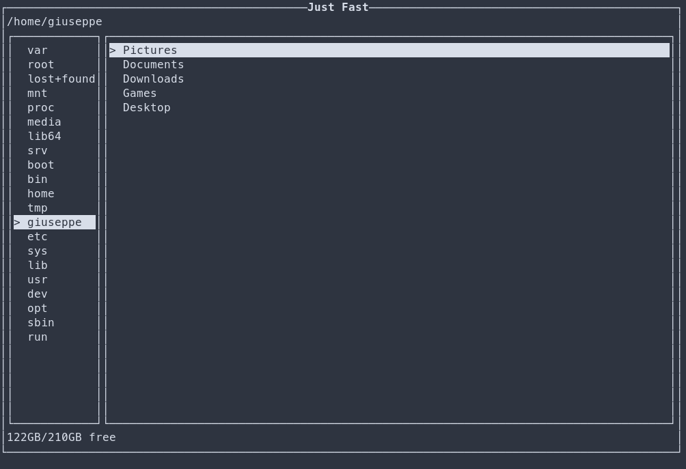

# ⚡ Just Fast

`c++17`

[](https://www.codacy.com/manual/pecorainpannacotta/just-fast?utm_source=github.com&utm_medium=referral&utm_content=GiuseppeCesarano/just-fast&utm_campaign=Badge_Grade)

Just Fast is a CLI file manager with focus on speed in both execution times and usage. 🚀  
_Note that this is highly work in progress and sperimental, so expect missing features and a lot of bugs._



## 📖 Info

Just Fast is a _modal_ file manager, to execute any action you need to select each file and enter a mode (copy, move, delete) once you selected every file and a mode, you can confirm the operation with the confirm key.

Supported OS:

-   [x] MacOs 🍎
-   [x] Gnu/Linux 🐧
-   [x] Windows 🪟. Drive ?

## Fork

development:

- Windows 
- vc2022

### meson build

cmake to meson.

```
> meson setup builddir --prefix $(pwd)/prefix 
> meson install -C builddir
```

## Try Just Fast

If you have **git** and **cmake** installed you can use the following one line command to download and compile _Just Fast_.  
`git clone https://github.com/GiuseppeCesarano/just-fast.git && cd just-fast && cmake . -B build -DCMAKE_BUILD_TYPE=Release && cd build && cmake --build .`

## ⌨️ Keybindings

This is the complete list of default keybindings :

-   `j` or `↓`: Highlight next file
-   `k` or `↑`: Highlight previous file
-   `l` or `→`: Open highlighted file
-   `h` or `←`: Back to parent folder
-   `f`: Add highlighted file to seleted list
-   `c`: Enter COPY mode
-   `m`: Enter MOVE mode
-   `d`: Enter DELETE mode
-   `SpaceBar`: Confirm operation (Copy/move selected files to current path; delete selected files)
-   `Esc`: Clear mode and selected files.
-   `a`: Toggle hidden files
-   `q`: Quit
